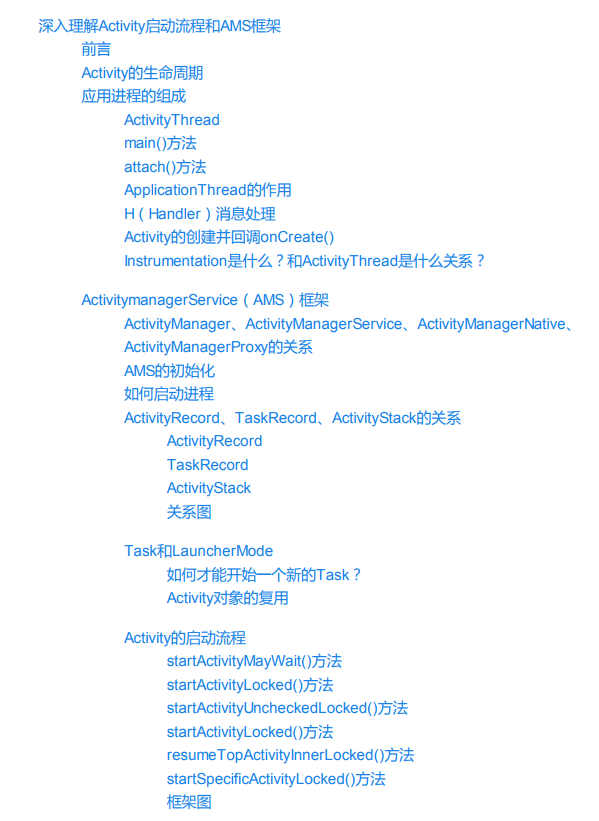
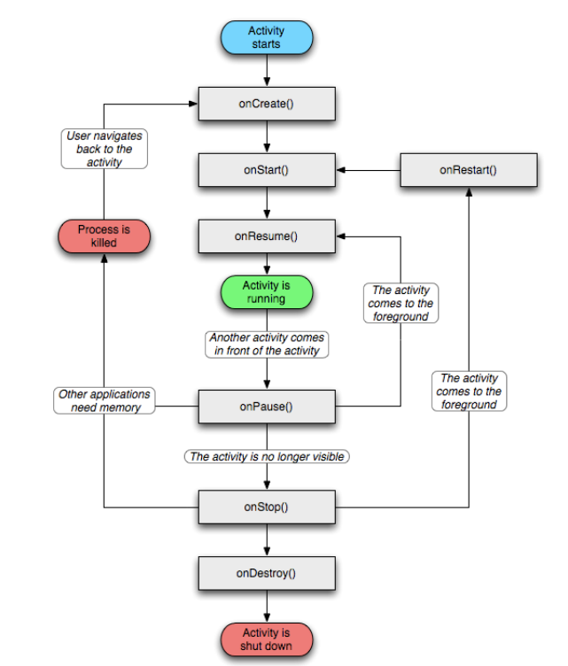
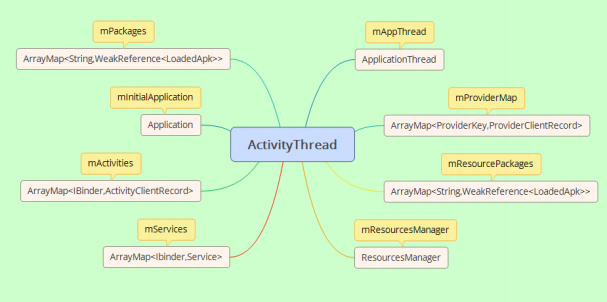
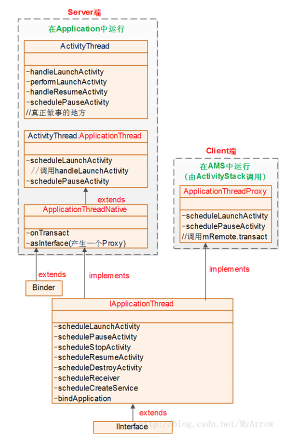
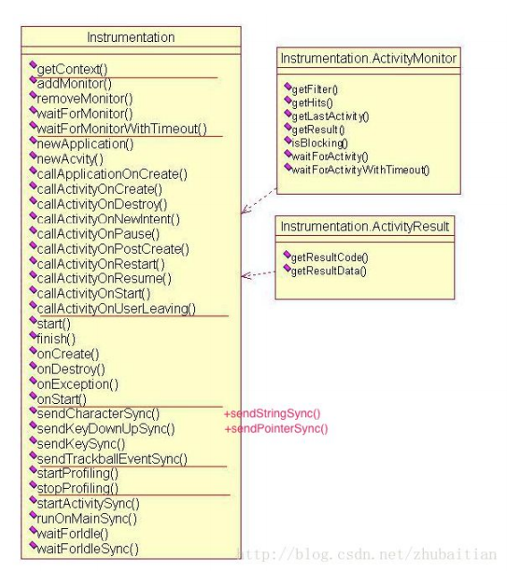
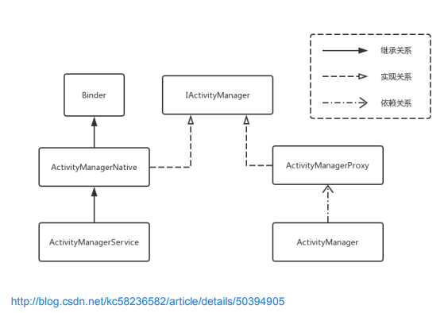
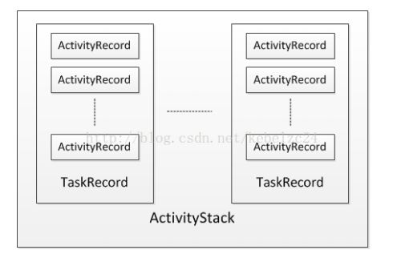
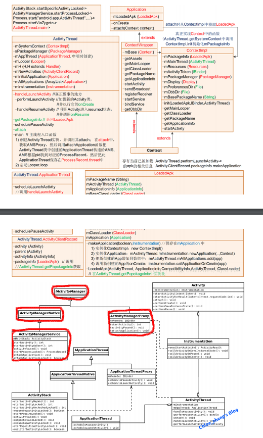

# 深入理解Activity启动流程和AMS框架

# 一、前言
- 一个App是怎么启动起来的？
- App的程序入口到底是哪里？
- Activity生命周期到底是什么时候调用的？被谁调用的？
- 听说还有个AMS的东西，它是做什么的？它是怎样管理和启动Activity的？
- ActivityThread、ApplicationThread、ActivityRecord、ActivityStack、TaskRecord都是些什么鬼？它们之间又有什么样的联系？
- 我们项目中遇到的关于Activity启动流程的例子？
- 等等...

>你是不是还有很多类似的疑问一直没有解决？没关系，今天我们将结合源码和一些优秀文章，站在巨人的肩膀上，用更加通俗易懂的方式来试着解开谜底。毕竟代码繁多、经验有限，如果有纰漏的地方希望大家指正，相互学习。

Android应用程序的载体是APK文件，它是一个组件和资源的容器。APK文件和我们常见可执行文件的区别是：每个可执行文件在一个单独的进程中，但是APK文件可能运行在一个单独的进程也可能和其他APK文件运行在同一个进程中。**Android的设计理念是弱化进程的存在，取而代之以组件的概念。**

# 二、Activity的生命周期
**Activity**是最复杂的一种组件，它负责UI的显示以及处理各种输入事件。Activity通常表现为一个可视化的用户界面，包含了各种各样的控件，让用户来完成某项工作，例如打电话、发短信、拍照等。

我们来看一下这一张经典的生命周期流程图：

Android SDK中提供的Activity生命周期图，隐含了Activity运行时的3种状态：

- **激活态** ：新启动的Activity位于屏幕的最前端，接收用户的输入。>>**onResume()**
- **暂停态** ：当Activity被另一个透明或半透明的Activity覆盖时所处的状态，例如：Dialog。此时的Activity虽然已经不能接收用户的输入，但还是可见的。>>**onPause()**
-  **停止态** ：当一个Activity完全被另外一个Activity覆盖，不能接收用户输入也不可见。>>**onStop()**

>**Question：Activity生命周期到底是什么时候调用的？被谁调用的？**

# 三、应用进程的组成
Android建立在Linux系统之上，基础的运行环境还是由进程组成。所有Android的应用进程都是由**Zygote**进程fork出来，因此，构成进程的底层基础，包括虚拟机、动态库等都是相同的。除了从Zygote中继承而来的基础设施外，Android需要在应用的Java层建立一套框架来管理运行的组件。由于应用的配置各不相同，因此，不能在Zygote中完全建好后再继承，只能在应用启动时创建。而这套框架就构成了Android应用的基础。

### 1、ActivityThread
Android应用进程的核心是**ActivityThread **类，App的真正入口。每启动一个App进程，都会创建ActivityThread与之对应的实例，会调用main()开始运行，开启消息循环队列，这就是传说中的UI线程或者叫**主线程**。这个类包含了应用框架中其他重要的类。

	public final class ActivityThread {
	...
	final ApplicationThread mAppThread = new ApplicationThread();
    final Looper mLooper = Looper.myLooper();
    final H mH = new H();
    Application mInitialApplication;
    Instrumentation mInstrumentation;
    private final ResourcesManager mResourcesManager;
    final ArrayMap<IBinder, ActivityClientRecord> mActivities = new ArrayMap<>();
    final ArrayMap<IBinder, Service> mServices = new ArrayMap<>();
    final ArrayMap<String, WeakReference<LoadedApk>> mPackages
            = new ArrayMap<String, WeakReference<LoadedApk>>();
    final ArrayMap<String, WeakReference<LoadedApk>> mResourcePackages
            = new ArrayMap<String, WeakReference<LoadedApk>>();
	final ArrayMap<ProviderKey, ProviderClientRecord> mProviderMap
        = new ArrayMap<ProviderKey, ProviderClientRecord>();
    ...
	public static void main(String[] args) {  
        SamplingProfilerIntegration.start();  
  
        // CloseGuard defaults to true and can be quite spammy.  We  
        // disable it here, but selectively enable it later (via  
        // StrictMode) on debug builds, but using DropBox, not logs.  
        CloseGuard.setEnabled(false);  
  
        Environment.initForCurrentUser();  // 初始化应用中需要使用的系统路径
  
        // Set the reporter for event logging in libcore  
        EventLogger.setReporter(new EventLoggingReporter());  
  
        Process.setArgV0("<pre-initialized>");  // 设置进程名称 
  
        Looper.prepareMainLooper();  
  
        ActivityThread thread = new ActivityThread();  // 创建ActivityThread实例
        thread.attach(false);                          // 调用attach
  
        if (sMainThreadHandler == null) {   // 保存主线程的handler 
            sMainThreadHandler = thread.getHandler();  
        }  
  
        AsyncTask.init();  // 初始化AsynTask类
     
        Looper.loop();  // 进入消息循环
  
        throw new RuntimeException("Main thread loop unexpectedly exited");  
    }  
    ...
    /**
    * 调用mH发送消息排队处理事件
    */
    private void sendMessage(int what, Object obj, int arg1, int arg2, boolean async) {
        Message msg = Message.obtain();
        msg.what = what;
        msg.obj = obj;
        msg.arg1 = arg1;
        msg.arg2 = arg2;
        if (async) {
            msg.setAsynchronous(true);
        }
        mH.sendMessage(msg);
  	 }
   	...
	}

我们梳理一下这个ActivityThread类：

- mActivities、mServices和mProviderMap分别保存了应用中所有的Activity对象、Service对象和ContentProvider对象。BroadcastReceiver对象的生命周期很短暂，属于调用一次运行一次的类型，因此不需要保存其对象。
- mInitialApplication变量是一个唯一的Application对象，允许自定义。
- mResourceManager管理应用的资源。
- mPackages和mResourcesPackages保存的是应用apk包的信息。（比如，通过属性process设置相同的应用名称后，两个有着相同ShareUserId和签名的应用可以合并在同一个进程运行）

>**ActivityThread** 管理应用进程的主线程的执行(相当于普通Java程序的main入口函数)，并根据AMS的要求（通过IApplicationThread接口，AMS为Client、ActivityThread.ApplicationThread为Server）负责调度和执行四大组件activities、services、broadcasts、providers，以及其它操作。

### 2、main()方法
main()法的逻辑比较简单，主要是初始化环境，然后让线程进入消息循环。在进行消息循环前，main方法创建了ActivityThread对象，并使用参数false调用了他的attach()方法。

### 3、attach()方法
我们看看attach()方法中参数为false时的分支代码：

		private void attach(boolean system) {
				sCurrentActivityThread = this;
		        mSystemThread = system;
		        if (!system) {
			        ......
		            android.ddm.DdmHandleAppName.setAppName("<pre-initialized>",
		                    UserHandle.myUserId());
		            RuntimeInit.setApplicationObject(mAppThread.asBinder());
		            // 客户端调用ActivityManagerNative.getDefault()返回的是ActivityManagerProxy
		            // 也就是从ServiceManger获取AMS的IBinder对象
		            final IActivityManager mgr = ActivityManagerNative.getDefault();
		            try {
		                logAppLaunchTime(TAG, "attachApplication -> AMS"); /// M: It's for debugging App Launch time
		                mgr.attachApplication(mAppThread);  // 调用AMS的attachApplication方法
		            } catch (RemoteException ex) {
		                // Ignore
		            }
		           ......
		        } else {
		        ......
		        }
		    }
		} 

attach()方法中主要做了两件事情，一是调用setApplicationObject()方法把对象mAppThread放到了RuntimeInit类中的静态变量mApplicationObject中。

	public class RuntimeInit {
		......
		public static final void setApplicationObject(Ibinder app) {
			mApplicationObject = app;
		}
		......
	}

第二件事情是调用ActivityManagerService的attachApplication方法，同时将mAppThread作为参数传递给了AMS中，这样AMS就能通过它来调用应用的接口了（Binder通信）。attachApplication方法最终实现是attachApplicationLocked。

	public final class ActivityManagerService extends ActivityManagerNative
	        implements Watchdog.Monitor, BatteryStatsImpl.BatteryCallback {
	        ......
		private final boolean attachApplicationLocked(IApplicationThread thread, int pid) {
			......
			try {
	           ......
	           // 调用应用的bindApplication接口
	           thread.bindApplication(processName, appInfo, providers, app.instrumentationClass,
	                    profilerInfo, app.instrumentationArguments, app.instrumentationWatcher,
	                    app.instrumentationUiAutomationConnection, testMode, enableOpenGlTrace,
	                    isRestrictedBackupMode || !normalMode, app.persistent,
	                    new Configuration(mConfiguration), app.compat,
	                    getCommonServicesLocked(app.isolated),
	                    mCoreSettingsObserver.getCoreSettingsLocked());
	            ......
	        } catch (Exception e) {
	            ......
	            return false;
	        }
		    ......
		    // See if the top visible activity is waiting to run in this process...
	        if (normalMode) {
	            try {
		            // 调用mStackSupervisor.attachApplicationLocked接口
		            // 如果进程没有启动，最后就是调用realStartActivityLocked()启动进程
	                if (mStackSupervisor.attachApplicationLocked(app)) {
	                    didSomething = true;
	                }
	            } catch (Exception e) {
	                badApp = true;
	            }
	        }
	        
	        // Find any services that should be running in this process...
	        if (!badApp) {
	            try {
	                didSomething |= mServices.attachApplicationLocked(app, processName);
	            } catch (Exception e) {
	                Slog.e(TAG, "Exception thrown starting services in " + app, e);
	                badApp = true;
	            }
	        }
	
	        // Check if a next-broadcast receiver is in this process...
	        if (!badApp && isPendingBroadcastProcessLocked(pid)) {
	            try {
	                didSomething |= sendPendingBroadcastsLocked(app);
	            } catch (Exception e) {
	                // If the app died trying to launch the receiver we declare it 'bad'
	                Slog.wtf(TAG, "Exception thrown dispatching broadcasts in " + app, e);
	                badApp = true;
	            }
	        }
	        ......
		}
		......
	}

attachApplicationLocked()方法首先检查调用的参数，然后又回调ApplicationThread的接口**bindApplication()**，bindApplication()发送完消息BIND_APPLICATION然后就返回了，这样执行过程就转到应用的消息处理代码中。除了开启Activity能启动进程外，启动Service、发送广播也可能需要启动进程，因此，这里也调用了mServices.attachApplication()方法，以及sendPendingBroadcastsLocked来启动进程。

下面再回头看看ActivityThread是如何处理BIND_APPLICATION消息的。

		private void handleBindApplication(AppBindData data) {
		        mBoundApplication = data;
		        // 创建系统配置对象
		        mConfiguration = new Configuration(data.config);
		        mCompatConfiguration = new Configuration(data.config);
				......
			    // 设置进程的名称和DDMS中的进程名
		        Process.setArgV0(data.processName);
		        android.ddm.DdmHandleAppName.setAppName(data.processName,
		                                                UserHandle.myUserId());
		        if (data.persistent) {
		            // 带有Persistent标记的进程在低内存的设备上不能使用硬件加速
		            if (!ActivityManager.isHighEndGfx()) {
		                /// M: ALPS01978329 for 512m project
		                final long LOW_MEMORY_SIZE = 256 * 1024 * 1024;
		                MemInfoReader minfo = new MemInfoReader();
		                minfo.readMemInfo();
		                if ((minfo.getTotalSize() <= LOW_MEMORY_SIZE) || (!"com.android.systemui".equals(data.processName))) {
		                    HardwareRenderer.disable(false);
		                    Slog.w(TAG, "Disable HWUI for Process(" + data.processName + "); Total Memory = " + minfo.getTotalSize());
		                }
		            }
		        }
				......
			    // 用系统的配置设置应用的时区
		        TimeZone.setDefault(null);
				// 用系统的配置设置应用的地区
		        Locale.setDefault(data.config.locale);
		        
		        // 生成资源管理对象mResourcesManager，并用系统配置初始化
		        mResourcesManager.applyConfigurationToResourcesLocked(data.config, data.compatInfo);
		        mCurDefaultDisplayDpi = data.config.densityDpi;
		        applyCompatConfiguration(mCurDefaultDisplayDpi);
		        ......
		        
		        // 生成ContentImpl对象
		        final ContextImpl appContext = ContextImpl.createAppContext(this, data.info);
		        if (!Process.isIsolated()) {
			        // 设置cache目录
		            final File cacheDir = appContext.getCacheDir();
			
		            if (cacheDir != null) {
		                // Provide a usable directory for temporary files
		                System.setProperty("java.io.tmpdir", cacheDir.getAbsolutePath());
		            } else {
		                Log.v(TAG, "Unable to initialize \"java.io.tmpdir\" property due to missing cache directory");
		            }
		
		            // Use codeCacheDir to store generated/compiled graphics code
		            final File codeCacheDir = appContext.getCodeCacheDir();
		            if (codeCacheDir != null) {
		                setupGraphicsSupport(data.info, codeCacheDir);
		            } else {
		                Log.e(TAG, "Unable to setupGraphicsSupport due to missing code-cache directory");
		            }
		        }
				......
				
		        IBinder b = ServiceManager.getService(Context.CONNECTIVITY_SERVICE);
		        if (b != null) {
			        // 设置网络代理
		            IConnectivityManager service = IConnectivityManager.Stub.asInterface(b);
		            try {
		                final ProxyInfo proxyInfo = service.getProxyForNetwork(null);
		                Proxy.setHttpProxySystemProperty(proxyInfo);
		            } catch (RemoteException e) {}
		        }
		
		        if (data.instrumentationName != null) {
		           ......
		        } else { // 创建Instrumentation对象
		           mInstrumentation = new Instrumentation();
		        }
		
		        if ((data.appInfo.flags&ApplicationInfo.FLAG_LARGE_HEAP) != 0) {
			        // 如果应用指定使用big heap，则清除dalvik中的限制
		            dalvik.system.VMRuntime.getRuntime().clearGrowthLimit();
		        } else {
		            // Small heap, clamp to the current growth limit and let the heap release
		            // pages after the growth limit to the non growth limit capacity. b/18387825
		            dalvik.system.VMRuntime.getRuntime().clampGrowthLimit();
		        }
		
		        final StrictMode.ThreadPolicy savedPolicy = StrictMode.allowThreadDiskWrites();
		        try {
		            // 最终，生成Application对象
		            Application app = data.info.makeApplication(data.restrictedBackupMode, null);
		            mInitialApplication = app;
		            if (!data.restrictedBackupMode) {
		                List<ProviderInfo> providers = data.providers;
		                if (providers != null) {
			                // 初始化应用的ContentProvider
		                    installContentProviders(app, providers);
		                    // For process that contains content providers, we want to
		                    // ensure that the JIT is enabled "at some point".
		                    mH.sendEmptyMessageDelayed(H.ENABLE_JIT, 10*1000);
		                }
		            }
		
		            try { 
			            // 调用mInstrumentation对象的onCreate()方法
		                mInstrumentation.onCreate(data.instrumentationArgs);
		            }
		            catch (Exception e) {
		                throw new RuntimeException(
		                    "Exception thrown in onCreate() of "
		                    + data.instrumentationName + ": " + e.toString(), e);
		            }
		
		            try {
			            // 调用Application对象的onCreate()方法
		                mInstrumentation.callApplicationOnCreate(app);
		            } catch (Exception e) {
		                if (!mInstrumentation.onException(app, e)) {
		                    throw new RuntimeException(
		                        "Unable to create application " + app.getClass().getName()
		                        + ": " + e.toString(), e);
		                }
		            }
		        } finally {
		            StrictMode.setThreadPolicy(savedPolicy);
		        }
		    }

handleBindApplication()方法的主要功能就是创建应用框架中的各种对象，这些对象大都已经介绍过了。最终调用到应用的Application.onCreate()，整个应用进程也就创建完毕。

### 4、ApplicationThread的作用
ApplicationThread是ActivityThead的一个内部类，是一个Binder服务类，**ActivityManagerService操作应用就是通过ApplicationThread提供的接口完成的**。

	final ApplicationThread mAppThread = new ApplicationThread();
	
	private class ApplicationThread extends ApplicationThreadNative { 
		...
		public final void schedulePauseActivity(IBinder token, boolean finished,
	                boolean userLeaving, int configChanges, boolean dontReport) {
	            sendMessage(
	                    finished ? H.PAUSE_ACTIVITY_FINISHING : H.PAUSE_ACTIVITY,
	                    token,
	                    (userLeaving ? 1 : 0) | (dontReport ? 2 : 0),
	                    configChanges);
	        }
	
	        public final void scheduleStopActivity(IBinder token, boolean showWindow,
	                int configChanges) {
	           sendMessage(
	                showWindow ? H.STOP_ACTIVITY_SHOW : H.STOP_ACTIVITY_HIDE,
	                token, 0, configChanges);
	        }
	        
	        public final void scheduleSleeping(IBinder token, boolean sleeping) {
	            sendMessage(H.SLEEPING, token, sleeping ? 1 : 0);
	        }
	
	        public final void scheduleResumeActivity(IBinder token, int processState,
	                boolean isForward, Bundle resumeArgs) {
	            updateProcessState(processState, false);
	            sendMessage(H.RESUME_ACTIVITY, token, isForward ? 1 : 0);
	        }
	
	        public final void scheduleSendResult(IBinder token, List<ResultInfo> results) {
	            ResultData res = new ResultData();
	            res.token = token;
	            res.results = results;
	            sendMessage(H.SEND_RESULT, res);
	        }
	
	        // we use token to identify this activity without having to send the
	        // activity itself back to the activity manager. (matters more with ipc)
	        @Override
	        public final void scheduleLaunchActivity(Intent intent, IBinder token, int ident,
	                ActivityInfo info, Configuration curConfig, Configuration overrideConfig,
	                CompatibilityInfo compatInfo, String referrer, IVoiceInteractor voiceInteractor,
	                int procState, Bundle state, PersistableBundle persistentState,
	                List<ResultInfo> pendingResults, List<ReferrerIntent> pendingNewIntents,
	                boolean notResumed, boolean isForward, ProfilerInfo profilerInfo) {
	
	            updateProcessState(procState, false);
	
	            ActivityClientRecord r = new ActivityClientRecord();
	
	            ...
	
	            sendMessage(H.LAUNCH_ACTIVITY, r);
	        }
	    ...  
	}  

ApplicationThread类从ApplicationThreadNative类派生，ApplicationThreadNative类中封装了Binder的实现。ApplicationThread虽然定义了大量的接口，但是接口的实现模式都是把Binder调用转换成**mH **的消息来**排队处理 **。

### 5、H（Handler）消息处理

	final H mH = new H();
	
	private class H extends Handler {  
	    ...
	    public void handleMessage(Message msg) {  
	        switch (msg.what) {  
	            case LAUNCH_ACTIVITY: {  
	                Trace.traceBegin(Trace.TRACE_TAG_ACTIVITY_MANAGER, "activityStart");  
	                ActivityClientRecord r = (ActivityClientRecord)msg.obj;  
	
	                r.packageInfo = getPackageInfoNoCheck(  
	                        r.activityInfo.applicationInfo, r.compatInfo);  
	                handleLaunchActivity(r, null);  
	                Trace.traceEnd(Trace.TRACE_TAG_ACTIVITY_MANAGER);  
	            } break; 
	            case RELAUNCH_ACTIVITY: {
	                Trace.traceBegin(Trace.TRACE_TAG_ACTIVITY_MANAGER, "activityRestart");
	                ActivityClientRecord r = (ActivityClientRecord)msg.obj;
	                handleRelaunchActivity(r);
	                Trace.traceEnd(Trace.TRACE_TAG_ACTIVITY_MANAGER);
	            } break;
	            case PAUSE_ACTIVITY:
	                Trace.traceBegin(Trace.TRACE_TAG_ACTIVITY_MANAGER, "activityPause");
	                handlePauseActivity((IBinder)msg.obj, false, (msg.arg1&1) != 0, msg.arg2,
	                        (msg.arg1&2) != 0);
	                maybeSnapshot();
	                Trace.traceEnd(Trace.TRACE_TAG_ACTIVITY_MANAGER);
	                break; 
	            ...  
	        }  
	    }  
	    ...  
	} 

消息的处理最终会调用ActivityThread类的某个方法完成。
通过这种模式，从Binder来的调用就转换成异步的方式来执行了。理解了这个过程之后，再分析ApplicationThread类的接口是时，我们可以忽略中间的消息传递过程，直接查看ActivityThread中对应的方法。

由此我们可以得到ActivityThread框架图：

>通常ApplicationThread中的接口方法都是以“**schedule**”开头，而ActivityThread中对应的处理方法则以“**handle**”开头。

### 6、Activity的创建并回调onCreate()
ActivityThread中的成员变量mActivities中保存了所有ActivityClientRecord对象，该类中重要的成员变量如下：

	static final class ActivityClientRecord {
		IBinder token;                // Activity对象的全局唯一标示
		Intent intent;                // 启动Activity的Intent
		Activity activity;            // Activity对象
	    Window window;                // Activity的窗口对象
	    boolean paused;               // 是否在暂停状态的标志
	    boolean stopped;              // 是否在停止状态的标志
	    ActivityInfo activityInfo;    // Activity的信息
	    LoadedApk packageInfo;        // 包的信息
	}

token的类型是IBinder，在ActivityManagerService中会为每个应用程序中的Activity对象建立了一个对应的ActivityRecord对象，ActivityRecord会创建一个token对象来作为Activity的标识。这个token是个Binder对象，但是它不是为提供Binder服务而创建的，这里只是利用Binder对象的 **系统全局唯一性** 来作为标识符。
每一个Activity都包含了一个Window对象，Window对象关联着应用框架的一大块内容。

从上面的框架图我们可以得知：启动一个Activity，首先会经过AMS和ActivityThread之间又长又臭的调用和回调，最终才会调到ActivityThread的handleLaunchActivity()方法。下面我们看一下接下来的流程。

	private void handleLaunchActivity(ActivityClientRecord r, Intent customIntent) {
		  ......
		  // 执行Activity创建和onCreate流程
	      Activity a = performLaunchActivity(r, customIntent);
	
	      if (a != null) {
	          r.createdConfig = new Configuration(mConfiguration);
	          Bundle oldState = r.state;
	          // 执行Activity的onResume流程
	          handleResumeActivity(r.token, false, r.isForward,
	                  !r.activity.mFinished && !r.startsNotResumed);
	          ......
	      } else {
	          // If there was an error, for any reason, tell the activity
	          // manager to stop us.
	          try {
	              ActivityManagerNative.getDefault()
	                  .finishActivity(r.token, Activity.RESULT_CANCELED, null, false);
	          } catch (RemoteException ex) {
	              // Ignore
	          }
	      }
	  }

handleLaunchActivity()再调用performLaunchActivity()方法来创建Activity并执行onCreate流程，返回后再执行Activity的onResume流程。继续深入，不要怂。

	private Activity performLaunchActivity(ActivityClientRecord r, Intent customIntent) {
		 // 首先，从ActivityClientRecord中获取待启动的Activity的组件信息	        
	     ActivityInfo aInfo = r.activityInfo;
	     if (r.packageInfo == null) {
		     // 获取Activity的packageInfo 
	         r.packageInfo = getPackageInfo(aInfo.applicationInfo, r.compatInfo,
	                 Context.CONTEXT_INCLUDE_CODE);
	     }
	
	     ComponentName component = r.intent.getComponent();
	     if (component == null) {
		     // 获取Activity的ComponentName 
	         component = r.intent.resolveActivity(
	             mInitialApplication.getPackageManager());
	         r.intent.setComponent(component);
	     }
	
	     if (r.activityInfo.targetActivity != null) {
	         component = new ComponentName(r.activityInfo.packageName,
	                 r.activityInfo.targetActivity);
	     }
	
	     Activity activity = null;
	     try {
		     // 拿到加载Activity的ClassLoader, 创建Activity对象 
	         java.lang.ClassLoader cl = r.packageInfo.getClassLoader();
	         activity = mInstrumentation.newActivity(
	                 cl, component.getClassName(), r.intent);
	         StrictMode.incrementExpectedActivityCount(activity.getClass());
	         r.intent.setExtrasClassLoader(cl);
	         r.intent.prepareToEnterProcess();
	         if (r.state != null) {
	             r.state.setClassLoader(cl);
	         }
	     } catch (Exception e) {
	         if (!mInstrumentation.onException(activity, e)) {
	             throw new RuntimeException(
	                 "Unable to instantiate activity " + component
	                 + ": " + e.toString(), e);
	         }
	     }
	
	     try {
		     // 拿到当前进程中的Application对象
	         Application app = r.packageInfo.makeApplication(false, mInstrumentation);
	
	         if (activity != null) {
	             // 创建Activity的ApplicationContext
	             Context appContext = createBaseContextForActivity(r, activity);
	             CharSequence title = r.activityInfo.loadLabel(appContext.getPackageManager());
	             Configuration config = new Configuration(mCompatConfiguration);
		         // 调用Activity的attach方法在其内部保存一些ActivityClientRecord内的属性
		         // 来完成一些重要的数据初始化
	             activity.attach(appContext, this, getInstrumentation(), r.token,
	                     r.ident, app, r.intent, r.activityInfo, title, r.parent,
	                     r.embeddedID, r.lastNonConfigurationInstances, config,
	                     r.referrer, r.voiceInteractor);
				 ......
	             // 通过mInstrumentation调用Activity的onCreate方法
	             if (r.isPersistable()) {  
	                 mInstrumentation.callActivityOnCreate(activity, r.state, r.persistentState);
	             } else {
	                 mInstrumentation.callActivityOnCreate(activity, r.state);
	             }
	             ...
	             // 将ActivityClientRecord中的activity属性设置为当前activity
	             r.activity = activity;
	             ......
	         }
	         r.paused = true;
	         
			 // 以ActivityClientRecord中的token为key，mActivities中添加待启动的activity
	         mActivities.put(r.token, r);
	
	     } catch (SuperNotCalledException e) {
	         throw e;
	
	     } catch (Exception e) {
	         if (!mInstrumentation.onException(activity, e)) {
	             throw new RuntimeException(
	                 "Unable to start activity " + component
	                 + ": " + e.toString(), e);
	         }
	     }
	
	     return activity;
	 }

从上面代码我们发现，ActivityThread最后调用了mInstrumentation变量的newActivity()方法来创建Activity对象，并回调了callActivityOnCreate()方法，走完Activity的onCreate流程。

	public class Instrumentation {
		public void callActivityOnCreate(Activity activity, Bundle icicle) {
		    prePerformCreate(activity);
		    activity.performCreate(icicle); // 回调Activity.onCreate()
		    postPerformCreate(activity);
		}
		
		public void callActivityOnCreate(Activity activity, Bundle icicle,
	            PersistableBundle persistentState) {
	        prePerformCreate(activity)；
	        activity.performCreate(icicle, persistentState); // 回调Activity.onCreate()
	        postPerformCreate(activity);
	    }
	}

	public class Activity extends ContextThemeWrapper
	        implements LayoutInflater.Factory2,
	        Window.Callback, KeyEvent.Callback,
	        OnCreateContextMenuListener, ComponentCallbacks2,
	        Window.OnWindowDismissedCallback {
	        
		final void performCreate(Bundle icicle) {
	        onCreate(icicle);
	        mActivityTransitionState.readState(icicle);
	        performCreateCommon();
	    }
	
	    final void performCreate(Bundle icicle, PersistableBundle persistentState) {
	        onCreate(icicle, persistentState);
	        mActivityTransitionState.readState(icicle);
	        performCreateCommon();
	    }
	}

这样Activity在应用端进程ActivityThread的启动流程和生命周期回调流程都简单分析完了。

### Instrumentation是什么？和ActivityThread是什么关系？
**Instrumentation**可以理解为应用进程的**管家**，ActivityThread要执行创建或暂停某个Activity等操作时，都需要通过Instrumentation来进行具体的实现（回调Activity的生命周期）。每一个应用程序只有一个Instrumentation对象，每个Activity内都有一个对该对象的引用。
另外，当我们在Activity中调用startActivity()的 时候，实际上调用的还是Instrumentation的相关的方法mInstrumentation.execStartActivity()。

	public ActivityResult execStartActivity(
	        Context who, IBinder contextThread, IBinder token, String target,
	        Intent intent, int requestCode, Bundle options) {
	    IApplicationThread whoThread = (IApplicationThread) contextThread;
	    if (mActivityMonitors != null) {
	        synchronized (mSync) {
	            final int N = mActivityMonitors.size();
	            for (int i=0; i<N; i++) {
	                final ActivityMonitor am = mActivityMonitors.get(i);
	                if (am.match(who, null, intent)) {
	                    am.mHits++;
	                    if (am.isBlocking()) {
	                        return requestCode >= 0 ? am.getResult() : null;
	                    }
	                    break;
	                }
	            }
	        }
	    }
	    try {
	        intent.migrateExtraStreamToClipData();
	        intent.prepareToLeaveProcess();
	        // 通知AMS执行startActivity的流程
	        int result = ActivityManagerNative.getDefault()
	            .startActivity(whoThread, who.getBasePackageName(), intent,
	                    intent.resolveTypeIfNeeded(who.getContentResolver()),
	                    token, target, requestCode, 0, null, options);
	        checkStartActivityResult(result, intent);
	    } catch (RemoteException e) {
	        throw new RuntimeException("Failure from system", e);
	    }
	    return null;
	}
>**ActivityManagerNative.getDefault**返回的就是ActivityManagerService的远程接口，即ActivityManagerProxy。
除了启动Activity之外，还有很多方法，有兴趣的可以深入了解一下：

>**通俗的理解，ActivityThread负责创建这个“家庭”，并负责对外打交道，比如接收AMS的通知等。Instrumentation负责管理这个家庭，安排每个Activity的日常流程等工作。**

# 四、小结

AMS通过Binder进行IPC通讯，通知应用进程ActivityThread启动指定Activity

- 调用ApplicationThread.scheduleLaunchActivity()。
- 经过Handler消息传动，调用ActivityThread.handleLaunchActivity()。
- 调用ActivityThread.performLaunchActivity()完成Activity的加载，并最终调用Activity生命周期的onCreate()方法
- performLaunchActivity返回，继续调用ActivityThread.handleResumeActivity(),该方法内部又调用ActivityThread.performResumeActivity()，其内部仅仅调用了目标Activity的onResume()方法。到此Activity启动完成。
- Activity的其他生命周期方法onRestart等，可以根据onCreate流程为类推，举一反三。

# 五、ActivitymanagerService（AMS）框架
ActivitymanagerService是Android Framework的一个核心系统服务，它管理着Android系统中的4大组件：Activity、Service、ContentProvider和BroadcastReceiver。前面已经介绍了，Android希望模糊进程的作用，取而代之以组件的概念，AMS正是这一理念的实现。AMS除了管理这4大组件之外，同时也管理和调度所有用户进程。

### 1、ActivityManager、ActivityManagerService、ActivityManagerNative、ActivityManagerProxy的关系

AMS是一个Binder服务，但是AMS的Binder框架代码不是通过AIDL自动生成的。AMS从ActivityManagerNative类派生，这个类加上IActivityManager、ActivityManagerProxy和ActivityManager共同实现了AMS Binder框架。它们的关系如下图：

http://blog.csdn.net/kc58236582/article/details/50394905

- **ActivityManagerNative**类的代码虽然也很庞大，但只是实现Binder的框架，我们可以不用关心这个类的实现细节。
- **ActivityManagerProxy**类是作为ActivityManagerNative的嵌入类来实现的，它是代理对象，起接口作用。
- **ActivityManager**通过调用ActivityManagerNative的getDefault()方法来得到ActivityManagerProxy对象的引用。

理解了AMS的Binder框架类的作用，后面分析AMS服务的时候，可以不用关系这些类，只需要集中精力在AMS类的本身上。

### 2、AMS的初始化
AMS运行在**SystemServer**进程中，对象的创建是在SystemServer类初始化时完成的。

	public final class SystemServer {
		......
		private ActivityManagerService mActivityManagerService;
		private void startBootstrapServices() {
			...
			mActivityManagerService = mSystemServiceManager.startService(
	                ActivityManagerService.Lifecycle.class).getService();  // 创建AMS服务
	        mActivityManagerService.setSystemServiceManager(mSystemServiceManager);
	        mActivityManagerService.setInstaller(installer);
	        ...
		}
		......
	}

从代码中可以看到，这里调用了mSystemServiceManager.startService()方法，这个方法将根据传入的参数（类的class）来创建类的实例对象，并注册到ServiceManager中。
接下来我们看一下AMS的构造方法做了些什么：

	public ActivityManagerService(Context systemContext) {
	    mContext = systemContext;
	    mFactoryTest = FactoryTest.getMode();
	    // 获取运行在SystemServer中的ActivityThread对象
	    mSystemThread = ActivityThread.currentActivityThread();
	    // 创建用于处理消息的线程和Handler对象
	    mHandlerThread = new ServiceThread(TAG,
	            android.os.Process.THREAD_PRIORITY_FOREGROUND, false /*allowIo*/);
	    mHandlerThread.start();
	    mHandler = new MainHandler(mHandlerThread.getLooper());
	    // 创建用于UI操作相关的Handler对象
	    mUiHandler = new UiHandler();
	
		// 创建管理广播的数据结构
	    mFgBroadcastQueue = new BroadcastQueue(this, mHandler,
	            "foreground", BROADCAST_FG_TIMEOUT, false);
	    mBgBroadcastQueue = new BroadcastQueue(this, mHandler,
	            "background", BROADCAST_BG_TIMEOUT, true);
	    mBroadcastQueues[0] = mFgBroadcastQueue;
	    mBroadcastQueues[1] = mBgBroadcastQueue;
	
	    mServices = new ActiveServices(this);  // 创建管理组件Service的对象
	    mProviderMap = new ProviderMap(this);  // 创建管理组件Provider的对象
	
	    // 获取系统的data和system目录
	    File dataDir = Environment.getDataDirectory();
	    File systemDir = new File(dataDir, "system");
	    systemDir.mkdirs();
	
		// 创建BatteryStatsService服务
	    mBatteryStatsService = new BatteryStatsService(systemDir, mHandler);
	    mBatteryStatsService.getActiveStatistics().readLocked();
	    mBatteryStatsService.scheduleWriteToDisk();
	    mOnBattery = DEBUG_POWER ? true
	            : mBatteryStatsService.getActiveStatistics().getIsOnBattery();
	    mBatteryStatsService.getActiveStatistics().setCallback(this);
	    // 创建ProcessStatsService服务
	    mProcessStats = new ProcessStatsService(this, new File(systemDir, "procstats"));
		// 创建AppOpsService应用权限管理服务
	    mAppOpsService = new AppOpsService(new File(systemDir, "appops.xml"), mHandler);
		// 打开文件urigrants.xml
	    mGrantFile = new AtomicFile(new File(systemDir, "urigrants.xml"));
	
	    // 设置0号用户作为第一个用户
	    mStartedUsers.put(UserHandle.USER_OWNER, new UserState(UserHandle.OWNER, true));
	    mUserLru.add(UserHandle.USER_OWNER);
	    updateStartedUserArrayLocked();
		// 获取OpenglES的版本
	    GL_ES_VERSION = SystemProperties.getInt("ro.opengles.version",
	        ConfigurationInfo.GL_ES_VERSION_UNDEFINED);
	
	    mTrackingAssociations = "1".equals(SystemProperties.get("debug.track-associations"));
		// 设置mConfiguration配置项为系统缺省值
	    mConfiguration.setToDefaults();
	    mConfiguration.setLocale(Locale.getDefault());
	
	    mConfigurationSeq = mConfiguration.seq = 1;
	    mProcessCpuTracker.init();
	
	    mCompatModePackages = new CompatModePackages(this, systemDir, mHandler);
	    // 创建Intent “防火墙”
	    mIntentFirewall = new IntentFirewall(new IntentFirewallInterface(), mHandler);
	    // 创建最近任务栏的栈管理对象
	    mRecentTasks = new RecentTasks(this);
	    // 创建Activity栈的管理对象mStackSupervisor 
	    mStackSupervisor = new ActivityStackSupervisor(this, mRecentTasks); 
	    mTaskPersister = new TaskPersister(systemDir, mStackSupervisor, mRecentTasks);
		// 创建统计CPU使用情况的线程
	 	mProcessCpuThread = new Thread("CpuTracker") {
			......
		}
		
		// 把服务加到watchdog的监控中
	    Watchdog.getInstance().addMonitor(this);
	    Watchdog.getInstance().addThread(mHandler);
	}

AMS构造方法的主要作用是创建了4大组件Activity、Service、BroadcastReceiver和ContentProvider的管理对象以及一些内部对象，逻辑比较简单。

### 3、如何启动进程
AMS中启动一个进程调用的是addAppLocked()方法。

	final ProcessRecord addAppLocked(ApplicationInfo info, boolean isolated,
	            String abiOverride) {
	      ProcessRecord app;
	      // isolated为true表示要启动一个新进程
	      if (!isolated) { // 在已经启动的进程列表中查找
	          app = getProcessRecordLocked(info.processName, info.uid, true);
	      } else {
	          app = null;
	      }
	
	      if (app == null) {
		      // 创建一个ProcessRecord对象
	          app = newProcessRecordLocked(info, null, isolated, 0);
	          updateLruProcessLocked(app, false, null);
	          updateOomAdjLocked();
	      }
		  ......
	      if (app.thread == null && mPersistentStartingProcesses.indexOf(app) < 0) {
	          mPersistentStartingProcesses.add(app);
	          // 启动进程
	          startProcessLocked(app, "added application", app.processName, abiOverride,
	                  null /* entryPoint */, null /* entryPointArgs */);
	      }
	
	      return app;
	  }

addAppLocked()方法会根据参数isolated来决定是否启动一个新进程，如果为true，即使系统中可能已经有一个同名的进程存在，也会再创建一个新进程。getProcessRecordLocked()方法用来在当前运行的进程列表中查找进程。newProcessRecordLocked()方法用来创建一个ProcessRecord的数据结构。updateLruProcessLocked方法用来更新运行中的进程的状态，updateOomAdjLocked用来更新进程的优先级，这两个方法是Process管理的核心。篇幅有限，这里不再展开分析咯。

### 4、ActivityRecord、TaskRecord、ActivityStack的关系
#### (1)、ActivityRecord

	final class ActivityRecord {
		// AMS的引用  
	    final ActivityManagerService service; // owner  
	    // token用来和WMS交互  
	    final IApplicationToken.Stub appToken; // window manager token  
	    final ActivityInfo info; // all about me  
	    final ApplicationInfo appInfo; // information about activity's app  
	    final ComponentName realActivity;  // the intent component, or target of an alias.
	    ...  
	  
	    //Activity资源信息  
	    CharSequence nonLocalizedLabel;  // the label information from the package mgr.  
	    int labelRes;           // the label information from the package mgr.  
	    int icon;               // resource identifier of activity's icon.  
	    int logo;               // resource identifier of activity's logo.  
	    int theme;              // resource identifier of activity's theme.  
	    int realTheme;          // actual theme resource we will use, never 0.  
	    int windowFlags;        // custom window flags for preview window.  
	      
	    // ActivityRecord所在的TaskRecord  
	    TaskRecord task;        // the task this is in.  
	    ...  
	    // ActivityRecord所在进程  
	    ProcessRecord app;      // if non-null, hosting application  
	    ActivityState state;    // current state we are in  
	    ...  
	}

ActivityRecord就是Activity在AMS中的代表，ActivityRecord和应用中的Activity一一对应，并且包含了Activity的所有信息。（就好比Activity在ActivityThread中对应ActivityClientRecord一样）
每一个ActivityRecord都会有一个Activity与之对应，一个Activity可能会有多个ActivityRecord，因为Activity可以被多次实例化，取决于其Launchmode。
其中task对象标识了其所归属的TaskRecord，这样ActivityRecord和TaskRecord就联系起来了。

#### (2)TaskRecord

	final class TaskRecord {
		// TaskRecord的唯一标识  
	    final int taskId;       // Unique identifier for this task.  
	    .....  
	    // This represents the last resolved activity values for this task  
	    // NOTE: This value needs to be persisted with each task  
	    TaskDescription lastTaskDescription = new TaskDescription();  
	  
	    // TaskRecord里所有的ActivityRecord信息  
	    /** List of all activities in the task arranged in history order */  
	    final ArrayList<ActivityRecord> mActivities;  
	  
	    // TaskRecord所在的stack  
	    ActivityStack stack;  
	    ......
	}

TaskRecord中我列出来三个成员变量：

- **taskId**：唯一标示的id号
- **mActivities**：当前栈中所有的ActivityRecord
- **stack**：ActivityStack的引用，为了回调ActivityStack的方法

从TaskRecord 的数据结构我们可以看到，mActivities保存了一组ActivityRecord信息，同时每一个ActivityRecord都有其所在TaskRecord的引用。TaskRecord都有一个唯一标示taskId，还包含了ActivityStack的引用对象。
因此，TaskRecord可以理解为一个mActivities组成的栈，也可以理解为一个由一系列Activity组成的活动。

#### (3)、 ActivityStack

	final class ActivityStack {
	    /** 
	     * The back history of all previous (and possibly still 
	     * running) activities.  It contains #TaskRecord objects. 
	     */  
	    private final ArrayList<TaskRecord> mTaskHistory = new ArrayList<>();  
	  
	    ...  
	  
	    final int mStackId;  
	    ...  
	    /** Run all ActivityStacks through this */  
	    final ActivityStackSupervisor mStackSupervisor; 
	}

- **mStackId**：唯一标示的id号
- **mTaskHistory**：这个记录的是一组TaskRecord的栈信息
- **mStackSupervisor**：ActivityStack的管理类，也是为了方便管理Task，被AMS调用等

从名字上看，ActivityStack更像是一个栈，实际上它就是一个Manager的角色。
ActivityStack负责管理协调ActivityRecord和TaskRecord，通过mStackId来唯一标识，持有ActivityStackSupervisor的引用。

#### （4）、关系图
每一个ActivityRecord都会有一个Activity与之对应。一系列相关的ActivityRecord组成了一个TaskRecord，TaskRecord是存在于ActivityStack中，ActivityStackSupervisor是用来管理这些ActivityStack的。
下面是一个简单的关系图

**Task** 是Activity的集合。Android把用户一次相关操作用使用的Activity按照先后顺序保存在Task中，这样当用户按back键的时候就能按照相反的顺序依次返回退出。Task像一个栈，以先进后出的方式管理着Activity。系统运行时内存中会存在多个Task，当我们查看最近任务栏时，会弹出一个列表让你选择，这个列表就是系统中存在的Task集合，选择一个Task会将它所包含的Activity作为一个整体带到前台。Task中的Activity的顺序通常是不能改变的，只能压栈和出栈。

AMS中使用**ActivityStack** 类来管理Task，它管理的Task都存放在成员变量mTaskHistory中。mTaskHistory也是一个列表，存储的是TaskRecord对象。TaskRecord对象代表一个Task，他的成员变量mActivities也是一个列表，存储了属于该Task中的所有ActivityRecord对象。

### 5、Task和LauncherMode

#### （1）、如何才能开始一个新的Task？

Intent中定义了一个标志FLAG_ACTIVITY_NEW_TASK，在startActivity的Intent参数中加入该标志就能开启一个新的Task。但是，如果系统中已经有相同affinity的Task存在，这时候就不会再启动一个Task，而是将旧的Task带到前台。
**Affinity**的意思是“亲和度”、“密切关系”，它的类型是字符串，我们可以把它理解成Task的名称。Affinity字串在系统中是唯一的，AMS查找一个Task，最优先比较它的affinity。ActivityStack类中用来查找Task的方法是findTaskLocked()。

	ActivityRecord findTaskLocked(ActivityRecord target) {
	      ......
	      for (int taskNdx = mTaskHistory.size() - 1; taskNdx >= 0; --taskNdx) {
	          final TaskRecord task = mTaskHistory.get(taskNdx);
	          ......
	          if (!isDocument && !taskIsDocument && task.rootAffinity != null) {
	              if (task.rootAffinity.equals(target.taskAffinity)) {
	                  return r;
	              }
	          } else if (taskIntent != null && taskIntent.getComponent() != null &&
	                  taskIntent.getComponent().compareTo(cls) == 0 &&
	                  Objects.equals(documentData, taskDocumentData)) {
	              return r;
	          } else if (affinityIntent != null && affinityIntent.getComponent() != null &&
	                  affinityIntent.getComponent().compareTo(cls) == 0 &&
	                  Objects.equals(documentData, taskDocumentData)) {
	              return r;
	          }
	      }
	
	      return null;
	}
findTaskLocked()方法首先遍历已有TaskRecord对象的affinity变量是否等于ActivityRecord的taskAffinity变量，如果相同就直接把旧的Task带回前台，而不是new一个新的TaskRecord。
既然一个Task的affinity这么重要，它是在哪里定义的呢？在AndroidManifest.xml文件中：
- **Activity标签的taskAffinity属性**：当使用标志**FLAG_ACTIVITY_NEW_TASK**启动一个Activity时才起作用
- **Application标签的taskAffinity属性**：没有指定activity标签的taskAffinity属性的，将会继承application标签的taskAffinity属性
- **应用的包名packageName**：没有指定的情况，默认值

通常在开发中，很少应用会自定义一个taskAffinity属性，所以默认就是其包名。因此，在应用中如果启动本应用的另一个Activity，即便intent里添加了FLAG_ACTIVITY_NEW_TASK也不一定会启动一个新的Task，除非这个Activity定义了不同的taskAffinity属性。

#### （2）、Activity对象的复用
启动一个Activity时，如果系统的后台Task已经有一个该Activity的实例存在，那么系统会再创建一个新的Activity实例，还是将已经存在的Activity实例切换到前台呢？
答案是：都有可能。有很多因素可以影响结果，包括Activity的属性值以及Intent中指定的标志。我们先看看Activity的属性launcherMode会有哪些影响：

- **standard模式**：standard模式下的Activity每次启动时都会创建该Activity的实例对象；同一个Task中可以同时存在该Activity的多个实例；一个Activity的多个实例可以出现在多个Task栈中。

- **singleTop模式**：如果设置为singleTop模式的Activity实例位于Task的栈顶，则不会创建一个新的对象，但是该Activity对象切换到前台时，它的onNewIntent()方法将会被调用，新的intent通过这种方式传递给实例对象。如果Activity不在其Task的栈顶，就和standard模式一样，会创建新的实例对象。

- **singleTask模式**：设置为singleTask模式的Activity具有系统唯一性，只能在系统中创建该Activity的一个实例对象。启动设置为singleTask的Activity时，如果系统中已经存在该Activity的实例，则将其所在的Task排在它前面的Activity都出栈，将该Activity带到栈顶，并调用onNewIntent()方法，将新的intent传递给该实例。如果该Activity在系统中还没有实例对象，就会创建一个该Activity的实例对象，如果该Activity的taskAffinity属性值和当前Task的affinity值相同，它会加入到当前TAsk中，否则，即使启动该Activity的Intent中没有指定FLAG_ACTIVITY_NEW_TASK标志，也会启动新的Task，将Activity置于其中。

- **singleInstance模式**：设置为singleInstance模式的Activity同样具有系统唯一性，系统中只有该Activity的一个实例对象。同时Activity位于一个单独的Task中，该Task中也只有一个Activity。

- **allowTaskReparenting属性**：通常情况下，一个Activity创建出来后，会停留在某个Task中，直到它被销毁。但是如果Activity的allowTaskReparenting属性设置为true，则该Activity可以在不同的Task之间转移。但是，这个属性只有在启动Activity的Intent中设置了FLAG_ACTIVITY_RESET_TASK_IF_NEEDED标志时才起作用。

- **allowRetainTaskState属性**：默认情况下，如果一个Task位于后台的时间太长，系统会清理该Task中的Activity，除了最初启动的Task的Activity以外，其他的Activity都会被系统销毁。如果应用希望保留这些Activity，可以将启动Task的Activity的allowRetainTaskState属性设置为true。

- **clearTaskOnLaunch属性**：前面介绍了，当使用带有标志FLAG_ACTIVITY_NEW_TASK的Intent启动一个Activity时，如果该Acitivty位于一个Task中，会将Task整体带到前台，其中Activity保持不变。但是如果该Activity启动的是Task的根Activity（root Activity），同时该Activity的属性clearTaskOnLaunch设置为true，那么系统出了将Task带到前台外，还会清除除了root Activity以外的所有Activity。因此，这个属性的作用相当于每次销毁Task，然后重新开始一个。

- **finishOnTaskLaunch属性**：设置为true，系统将会销毁该Activity，然后重新再启动一个。

除了FLAG_ACTIVITY_NEW_TASK标志以外，Intent中还定义几个和Activity相关的标志：
- **FLAG_ACTIVITY_CLEAR_TOP**：如果启动的Activity已经存在，则把该Activity带到前台，并把它前面的Activity都出栈。
- **FLAG_ACTIVITY_BROUGHT_TO_FRONT**：如果启动的Activity已经存在，则把该Activity带到前台，但是不关闭它前面的Activity。
- **FLAG_ACTIVITY_SINGLE_TOP**：如果启动的Activity已经位于Task的栈顶，则不会创建一个新的Activity，而是把该Activity带到前台。

**Android开发——Intent中的各种FLAG**
http://blog.csdn.net/javensun/article/details/8700265

### 6、Activity的启动流程

#### （1）、startActivityMayWait()方法

AMS中提供了几个接口来启动Activity，但是，它们都会调用ActivityStackSupervisor类的startActivityMayWait()方法。

	public final class ActivityStackSupervisor implements DisplayListener {
		......
		final int startActivityMayWait(IApplicationThread caller, int callingUid,
		            String callingPackage, Intent intent, String resolvedType,
		            IVoiceInteractionSession voiceSession, IVoiceInteractor voiceInteractor,
		            IBinder resultTo, String resultWho, int requestCode, int startFlags,
		            ProfilerInfo profilerInfo, WaitResult outResult, Configuration config,
		            Bundle options, boolean ignoreTargetSecurity, int userId,
		            IActivityContainer iContainer, TaskRecord inTask) {
		    ......
		    intent = new Intent(intent);  // 创建一个新的Intent对象，方便改动
	        ActivityInfo aInfo =      // 获取即将启动的Activity的信息
	                resolveActivity(intent, resolvedType, startFlags, profilerInfo, userId);
	        ......
	        // 调用startActivityLocked方法
	        int res = startActivityLocked(caller, intent, resolvedType, aInfo,
	                    voiceSession, voiceInteractor, resultTo, resultWho,
	                    requestCode, callingPid, callingUid, callingPackage,
	                    realCallingPid, realCallingUid, startFlags, options, ignoreTargetSecurity,
	                    componentSpecified, null, container, inTask);
	        ...
	        if (outResult != null) {
	             outResult.result = res;
	             if (res == ActivityManager.START_SUCCESS) {
	                 mWaitingActivityLaunched.add(outResult);
	                 do {
	                     try {
	                         mService.wait();  // 等待应用进程中Activity的启动完成
	                     } catch (InterruptedException e) {
	                     }
	                 } while (!outResult.timeout && outResult.who == null);
	             }
	            ......    
	        }
	        ......
	        return res;
		}
	}

startActivityMayWait()首先调用resolveActivity()方法获取需要启动的Activity的信息，resolveActivity()方法通过调用PackageManagerService的resolveIntent()方法来获取Activity的信息，得到Activity的信息后，继续调用startActivityLocked()方法来继续启动Activity。如果启动Activity的应用需要返回结果，则调用mService对象的wait()方法挂起线程等待启动的结果。

#### （2）、startActivityLocked()方法
	
	final int startActivityLocked(IApplicationThread caller,
	            Intent intent, String resolvedType, ActivityInfo aInfo,
	            IVoiceInteractionSession voiceSession, IVoiceInteractor voiceInteractor,
	            IBinder resultTo, String resultWho, int requestCode,
	            int callingPid, int callingUid, String callingPackage,
	            int realCallingPid, int realCallingUid, int startFlags, Bundle options,
	            boolean ignoreTargetSecurity, boolean componentSpecified, ActivityRecord[] outActivity,
	            ActivityContainer container, TaskRecord inTask) {
	    ......
	    int err = ActivityManager.START_SUCCESS;
	    ProcessRecord callerApp = null;
	    if (caller != null) {
	        callerApp = mService.getRecordForAppLocked(caller);  // 得到调用进程的信息
	        ...
	    }
	    ...... // 错误检查
	    final int startAnyPerm = mService.checkPermission(
	                START_ANY_ACTIVITY, callingPid, callingUid);   // 检查调用者权限
	    ......
	    // 创建ActivityRecord对象
	    ActivityRecord r = new ActivityRecord(mService, callerApp, callingUid, callingPackage,
	                intent, resolvedType, aInfo, mService.mConfiguration, resultRecord, resultWho,
	                requestCode, componentSpecified, voiceSession != null, this, container, options);
	   ......
	   // 继续调用startActivityUncheckedLocked启动当前的Activity
	   err = startActivityUncheckedLocked(r, sourceRecord, voiceSession, voiceInteractor,
	                startFlags, true, options, inTask);  
	   ......
	   return err;                    
	}

startActivityLocked()方法首先进行了各种错误检查，接着检查调用者的权限，以及Intent防火墙是否屏蔽了该Intent（规则是通过/data/system/ifw目录下的文件设置的）。完成所有检查后，穿件一个ActivityRecord对象，并调用getFocusedStack()方法来获取当前具有用户输入焦点的ActivityStack。

#### （3）、startActivityUncheckedLocked()方法

	final int startActivityUncheckedLocked(final ActivityRecord r, ActivityRecord sourceRecord,
	            IVoiceInteractionSession voiceSession, IVoiceInteractor voiceInteractor, int startFlags,
	            boolean doResume, Bundle options, TaskRecord inTask) {
	    // r：即将启动的Activity
	    // sourceRecord：启动r的源Activity，有可能为null
	    ......
		targetStack.startActivityLocked(r, newTask, doResume, keepCurTransition, options);
	    if (!launchTaskBehind) {
	        mService.setFocusedActivityLocked(r, "startedActivity");
	    }
	    return ActivityManager.START_SUCCESS;
	}

startActivityUncheckedLocked()方法的代码非常长，主要是通过判断Intent的标志和Activity的属性来确定Activity的Task，对于处理的细节我们就不分析了。有兴趣的童鞋可以结合上一届的内容自行分析。方法中找到包含Activity的Task后，调用ActivityStack的startActivityLocked()方法继续启动。

#### （4）、startActivityLocked()方法

	final void startActivityLocked(ActivityRecord r, boolean newTask,
	            boolean doResume, boolean keepCurTransition, Bundle options) {
	      TaskRecord rTask = r.task;
	      final int taskId = rTask.taskId;
	      if (!r.mLaunchTaskBehind && (taskForIdLocked(taskId) == null || newTask)) {
	          insertTaskAtTop(rTask, r);  // 如果是新的Task，就把它放在顶部
	          mWindowManager.moveTaskToTop(taskId);
	      }
	      TaskRecord task = null;
	      if (!newTask) {   // 如果不需要启动新的Task
	          boolean startIt = true;
	          for (int taskNdx = mTaskHistory.size() - 1; taskNdx >= 0; --taskNdx) {
	              task = mTaskHistory.get(taskNdx);
	              if (task.getTopActivity() == null) {
	                  continue;
	              }
	              if (task == r.task) {
	                  ......
	                  break;  // 找到了Task，跳出循环
	              } ...
	          }
	      }
	      
	      if (task == r.task && mTaskHistory.indexOf(task) != (mTaskHistory.size() - 1)) {
	          mStackSupervisor.mUserLeaving = false;
	      }
	      task = r.task;
	      task.addActivityToTop(r);  // 把Activity放到已找到Task的顶部
	      task.setFrontOfTask();
	      r.putInHistory();
	
	      // 调用WindowManagerService中的方法准备绘制Activity以及切换Activity动画
	      if (!isHomeStack() || numActivities() > 0) {
	         // 如果不是Home应用的Stack或者Stack中有Activity,
	         ......
	      } else {
	          mWindowManager.addAppToken(task.mActivities.indexOf(r), r.appToken,
	                  r.task.taskId, mStackId, r.info.screenOrientation, r.fullscreen,
	                  (r.info.flags & ActivityInfo.FLAG_SHOW_FOR_ALL_USERS) != 0, r.userId,
	                  r.info.configChanges, task.voiceSession != null, r.mLaunchTaskBehind);
	          ActivityOptions.abort(options);
	          options = null;
	      }
	      if (VALIDATE_TOKENS) {
	          validateAppTokensLocked();
	      }
	
	      if (doResume) {
		      // 启动Activity
	          mStackSupervisor.resumeTopActivitiesLocked(this, r, options);
	      }
	  }

> 这里调用了WindowManagerService的方法处理Activity的显示和切换动画。WMS以后由可视化组的同事讲解哈。

ActivityStack类的startActivityLocked()方法相对比较简单，就是讲ActivityRecord对象加入到Task的顶部，同时把Task也放到mHistoryStack列表的顶部。方法的最后通过mStackSupervisor对象的resumeTopActivitiesLocked方法来显示位于Task栈顶的Activity，这个方法在AMS中经常会被调用，主要作用是将位于栈顶的Activity显示出来。这时，当前的Activity（mResumedActivity对象引用）还显示在屏幕上。它最终会调用ActivityStack类的resumeTopActivityInnerLocked()方法，下来我们直接分析它的执行过程。

#### （5）、resumeTopActivityInnerLocked()方法

	private boolean resumeTopActivityInnerLocked(ActivityRecord prev, Bundle options) {
		......
		final ActivityRecord next = topRunningActivityLocked(null); // next表示即将启动的Activity
		if (next == null) {
			...... // 如果当前Task没有Activity，显示Home Activity
			return isOnHomeDisplay() &&  
	                    mStackSupervisor.resumeHomeStackTask(returnTaskType, prev, reason);
		}
		...
		if (mResumedActivity == next && next.state == ActivityState.RESUMED &&
	                    mStackSupervisor.allResumedActivitiesComplete()) {
	       ...
	       return false;  // 如果当前的Activity就是要启动的Activity，直接返回
	    }
		......
		if (mService.isSleepingOrShuttingDown()
	                && mLastPausedActivity == next
	                && mStackSupervisor.allPausedActivitiesComplete()) {
		    ...
	        return false;  // 如果系统正在睡眠或关闭，直接退出
	    }
	    ......
		if (prev != null && prev != next) {
	       if (!mStackSupervisor.mWaitingVisibleActivities.contains(prev)
	                && next != null && !next.nowVisible) {
	            // 如果Activity还不可见，把前一个Activity加入mWaitingVisibleActivities列表
	            mStackSupervisor.mWaitingVisibleActivities.add(prev);
	        } else {
	            if (prev.finishing) {  // 如果Activity已经是visible状态，把前一个Activity隐藏起来
	                mWindowManager.setAppVisibility(prev.appToken, false);
	            }
	        }
	    }
	    ......
	    boolean anim = true;
	    ......  // 调用WindowManagerService的方法处理Activity的显示
	    ActivityStack lastStack = mStackSupervisor.getLastStack();
	    if (next.app != null && next.app.thread != null) {
	        // 如果Activity的应用进程已存在，只需要把Activity显示出来即可
		    mWindowManager.setAppVisibility(next.appToken, true);
		    ......
		    try {
			    ArrayList<ResultInfo> a = next.results;
	            if (a != null) {  // 如果Activity中海油等待返回的结果，先发送结果
	                final int N = a.size();
	                if (!next.finishing && N > 0) {
	                    next.app.thread.scheduleSendResult(next.appToken, a);
	                }
	            }
	            if (next.newIntents != null) {  
	                // 如果满足前面介绍的几种重启Activity的情况，调用onNewIntent方法
	                next.app.thread.scheduleNewIntent(next.newIntents, next.appToken);
	            }
	            ... 
	            // 调用应用进程Activity的onResume流程
	            next.app.thread.scheduleResumeActivity(next.appToken, next.app.repProcState,
	                        mService.isNextTransitionForward(), resumeAnimOptions);
	            mStackSupervisor.checkReadyForSleepLocked();
			} catch (Exception e) {
				......
				return true;
			}
		} else {
			// 如果Activity所在的应用进程还没有启动，就先启动应用
			......
			mStackSupervisor.startSpecificActivityLocked(next, true, true);
		}
		return true;
	}

resumeTopActivityInnerLocked()方法虽然很长，但是去掉log和一些不太重要的分支代码后，整个逻辑还是比较清晰的，上面注释已经很详细了，这里不再重复。如果Activity所在的应用已经启动，这里将会调用应用进程的scheduleResumeActivity()方法，最终会回调ActivityThread执行Activity的onResume()方法。如果应用还没有启动，或者刚启动，则调用startSpecificActivityLocked()方法继续处理。

#### （6）、startSpecificActivityLocked()方法

	void startSpecificActivityLocked(ActivityRecord r,
	            boolean andResume, boolean checkConfig) {
	    ProcessRecord app = mService.getProcessRecordLocked(r.processName,
	            r.info.applicationInfo.uid, true);
	    r.task.stack.setLaunchTime(r);
	    if (app != null && app.thread != null) { // 判断应用进程是否已启动
	        try {
	            if ((r.info.flags&ActivityInfo.FLAG_MULTIPROCESS) == 0
	                    || !"android".equals(r.info.packageName)) {
	                app.addPackage(r.info.packageName, r.info.applicationInfo.versionCode,
	                        mService.mProcessStats);
	            }
	            realStartActivityLocked(r, app, andResume, checkConfig);
	            return;
	        } catch (RemoteException e) {
	            Slog.w(TAG, "Exception when starting activity "
	                    + r.intent.getComponent().flattenToShortString(), e);
	        }
	    }
		// 启动应用进程
	    mService.startProcessLocked(r.processName, r.info.applicationInfo, true, 0,
	            "activity", r.intent.getComponent(), false, false, true);
	}

startSpecificActivityLocked()方法中如果发现应用进程没有启动，则调用AMS的startProcessLocked()方法来启动进程（前面章节已经介绍过），否者调用realStartActivityLocked()方法继续执行。realStartActivityLocked()比较长，这里就不分析了，它最后调用到应用进程中的scheduleLaunchActivity()方法，从而回调Activity的onCreate流程。

### 7、框架图
通过上面AMS启动Activity所调用到的方法分析，这样Activity启动中涉及的所有回调接口我们都找到哦啊了调用的地方，整个流程也就非常清晰。

>**分析Activity启动流程，无非就是牢牢把握住两条主线：应用进程（ActivityThread）和服务端进程（AMS）**

下面我们欣赏一下最终的框架图：

